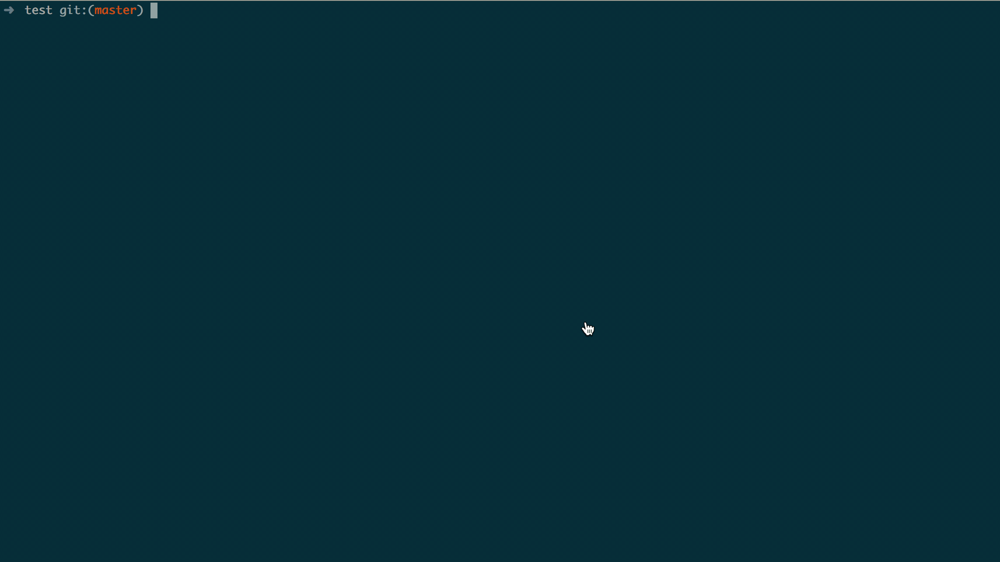

# GitFlow ToolKit

> 这是一个使用 go 编写的简单的 GitFlow 提交工具，用于规范 git commit 提交格式，目前仅支持 [Angular 社区规范](https://docs.google.com/document/d/1QrDFcIiPjSLDn3EL15IJygNPiHORgU1_OOAqWjiDU5Y/edit#heading=h.greljkmo14y0)；同时该工具集成了一些扩展动作，比如快速创建指定名称前缀分支、命令行发起 GitLab MR 等

## 支持命令

| 命令 | 描述 |
| --- | --- |
| ci | 交互式输入 `commit message`  |
| cm | 接受一个 `commit message` 字符串，并校验其格式(用作 commit hook) |
| xmr | 交互式创建 GitLab MR，如果当前项目未配置，则首先配置项目信息 |
| feat | 接受一个字符串，并创建一个 feat 分支，分支名称格式为 `feat/xxx` |
| fix | 创建 fix 分支 |
| hotfix | 创建 hotfix 分支(通常用于对 master 紧急修复) |
| docs | 创建 docs 分支 |
| style | 创建 style 分支 |
| refactor | 创建 refactor 分支 |
| chore | 创建 chore 分支 |
| perf | 创建 perf 分支 |
| style | 创建 style 分支 |

## 安装与卸载

下载对应二进制文件，执行 `gitflow-toolkit install/uninstall` 即可